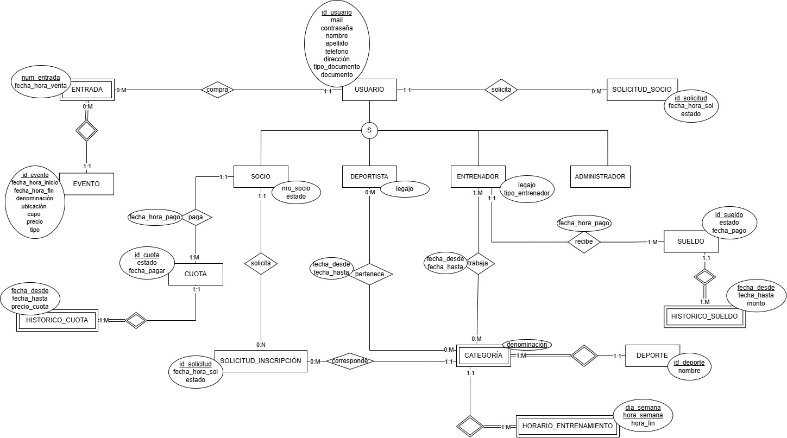

# Propuesta TP DSW

## Grupo
### Integrantes
* legajo - Alfonso, Avril Antonella
* 52184 - Luraschi Zárate, Alma
* 52879 - Rau, Anelen

### Repositorios
* [frontend app](http://hyperlinkToGihubOrGitlab)
* [backend app](http://hyperlinkToGihubOrGitlab)
*Nota*: si utiliza un monorepo indicar un solo link con fullstack app.

## Tema
### Descripción
Nombre del club amateur a definir. "Club" es una página/aplicación dedicada a la gestión del club amateur del mismo nombre para facilitar servicios a su comunidad. En este sistema pueden loguearse usuarios que, según su rol (administrador, entrenador, deportista, socio o ninguno de ellos), tendrán accesos específicos dentro de la web. El usuario común podrá comprar entradas para los eventos deportivos. Los socios podrán pagar sus cuotas desde la app e inscribirse a cualquier deporte. Los entrenadores verán el histórico de su sueldo y su próxima fecha de cobro. 

### Modelo

## Alcance Funcional 

### Alcance Mínimo

Regularidad:
|Req|Detalle|
|:-|:-|
|CRUD simple|1. CRUD Socio 2. CRUD Evento 3. CRUD Deporte|
|CRUD dependiente|1. CRUD Categoría {depende de} CRUD Deporte 2. CRUD Entrada {depende de} CRUD Evento y Usuario|
|Listado + detalle| 1. Listado de socios filtrado por estado, muestra id_usuario y nro_socio => detalle CRUD Usuario  2. Listado de deportistas filtrado por deporte, muestra id_usuario, legajo, nombre, apellido => detalle muestra datos completos de Categoría y Usuario|
|CUU/Epic|1. Registar usuario 2. Comprar de entrada|

Adicionales para Aprobación
|Req|Detalle|
|:-|:-|
|CRUD |1. CRUD Socio 2. CRUD Evento 3. CRUD Entrada 4. CRUD Deporte 5. CRUD Categoría 6. CRUD Horario Entrenamiento 7. CRUD Cuota 8. CRUD Histórico Cuota 9. CRUD Sueldo 10. CRUD Histórico Sueldo 11. CRUD Solicitud Socio 12. CRUD Solicitud Inscripción|
|CUU/Epic|1. Registar usuario 2. Comprar de entrada 3. Solicitar ser socio|

### Alcance Adicional Voluntario

|Req|Detalle|
|:-|:-|
|Listados |1.Listado de entrenadores filtrado por deporte, muestra id_usuario, legajo, tipo_entrenador nombre, apellido => detalle muestra datos completos de Categoría y Usuario|
|CUU/Epic|1. Solicitar inscribirse a categoría 2. Entrenador consulta el histórico de su sueldo y próxima fecha de cobro 3. Socio paga su cuota 4. Administrador da de baja a un socio|

